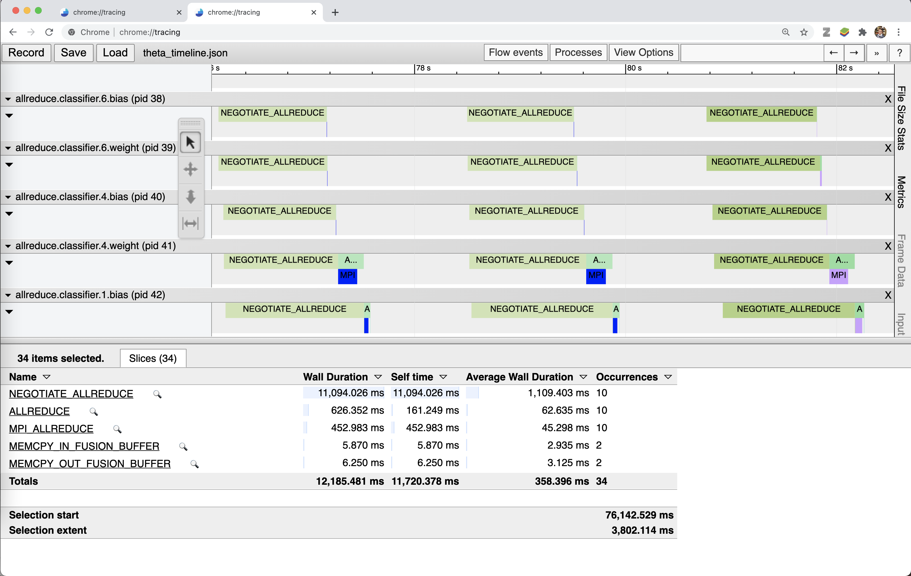
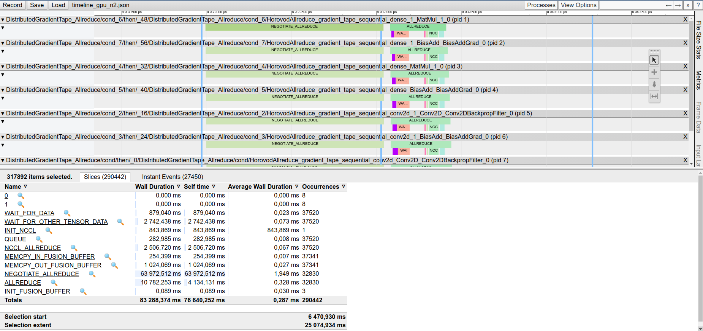

# Horovod Timeline Analysis for Data Parallel Training

Contact: Huihuo Zheng <huihuo.zheng@anl.gov>

This example shows the Horovod Timeline analysis. It will show the the timeline of communication in distributed training. 

To perform Horovod timeline analysis, one has to set the environment variable ```HOROVOD_TIMELINE``` which specifies the file for the output. 
  ```
  export HOROVOD_TIMELINE=timeline.json
  ```
  This file is only recorded on rank 0, but it contains information about activity of all workers. You can then open the timeline file using the `chrome://tracing` facility of the Chrome browser.

More details: https://horovod.readthedocs.io/en/stable/timeline_include.html

Visualize the results using Chrome chrome://tracing/

## Results on Theta
Summitting job on thetagpusn1
```bash
cd sdl_ai_workshop/04_profilingDeepLearning/HorovodTimeline/theta
qsub -n $NUM_NODES qsub.sc
```

What we find: 

   - NEGOTIATION ALLREDUCE is taking a lot of time
   - ALLREDUCE is using MPI_ALLREDUCE
   - Different tensors are reduced at different time. There is an overlap between MPI and compute
   



## Results on ThetaGPU
Summitting job on thetagpusn1

```bash
cd sdl_ai_workshop/04_profilingDeepLearning/HorovodTimeline/thetagpu
qsub -n $NUM_NODES qsub.sc
```

   - NEGOTIATION ALLREDUCE is taking a lot of time
   - ALLREDUCE is using NCCL_ALLREDUCE
   - Different tensors are reduced at different time. There is an overlap between MPI and compute

Single node (8GPU)



4 nodes 32 GPU


We find that there is a large portion of Negotiation all reduce in the beginning. Let us check the timing for each epoch. 

* 1 GPU

```
grep '(s)' pytorch_cifar10.out.1
Epoch 1:  training 3.9464917182922363(s) - testing 0.2842288017272949(s)
Epoch 2:  training 1.6418938636779785(s) - testing 0.2911264896392822(s)
Epoch 3:  training 1.6472668647766113(s) - testing 0.28443479537963867(s)
Epoch 4:  training 1.6244451999664307(s) - testing 0.2839221954345703(s)
Epoch 5:  training 1.6679177284240723(s) - testing 0.28382372856140137(s)
Epoch 6:  training 1.6592497825622559(s) - testing 0.28410863876342773(s)
Epoch 7:  training 1.6290247440338135(s) - testing 0.2838773727416992(s)
Epoch 8:  training 1.6339952945709229(s) - testing 0.28399038314819336(s)
Epoch 9:  training 1.6394035816192627(s) - testing 0.29134202003479004(s)
Epoch 10:  training 1.6315174102783203(s) - testing 0.2889261245727539(s)
```

* 2 GPU

```
grep '(s)' pytorch_cifar10.out.2
Epoch 1:  training 23.069223165512085(s) - testing 0.23567867279052734(s)
Epoch 2:  training 0.8957064151763916(s) - testing 0.21827197074890137(s)
Epoch 3:  training 0.6789329051971436(s) - testing 0.2231731414794922(s)
Epoch 4:  training 0.8881678581237793(s) - testing 0.23079824447631836(s)
Epoch 5:  training 0.8954207897186279(s) - testing 0.22843503952026367(s)
Epoch 6:  training 0.9121780395507812(s) - testing 0.3696882724761963(s)
Epoch 7:  training 0.9106247425079346(s) - testing 0.21846961975097656(s)
Epoch 8:  training 0.6733551025390625(s) - testing 0.23345375061035156(s)
Epoch 9:  training 0.893524169921875(s) - testing 0.21280503273010254(s)
Epoch 10:  training 0.9054818153381348(s) - testing 0.23321795463562012(s)
```

* 4 GPU

```
grep '(s)' pytorch_cifar10.out.4
Epoch 1:  training 22.359201908111572(s) - testing 0.15216565132141113(s)
Epoch 2:  training 0.4977378845214844(s) - testing 0.15857434272766113(s)
Epoch 3:  training 0.5023508071899414(s) - testing 0.1587541103363037(s)
Epoch 4:  training 0.5023791790008545(s) - testing 0.15345335006713867(s)
Epoch 5:  training 0.49753594398498535(s) - testing 0.15330028533935547(s)
Epoch 6:  training 0.5023701190948486(s) - testing 0.15367436408996582(s)
Epoch 7:  training 0.50240159034729(s) - testing 0.15417885780334473(s)
Epoch 8:  training 0.502795934677124(s) - testing 0.15332627296447754(s)
Epoch 9:  training 0.5076334476470947(s) - testing 0.1535167694091797(s)
Epoch 10:  training 0.49743175506591797(s) - testing 0.15375328063964844(s)
```
We can see that the issue of the scaling is from the first epoch!!