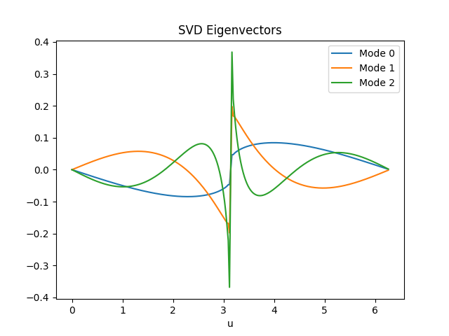
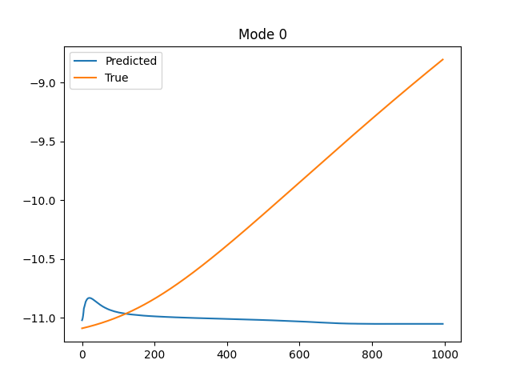
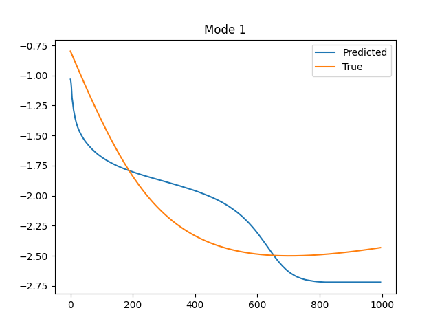
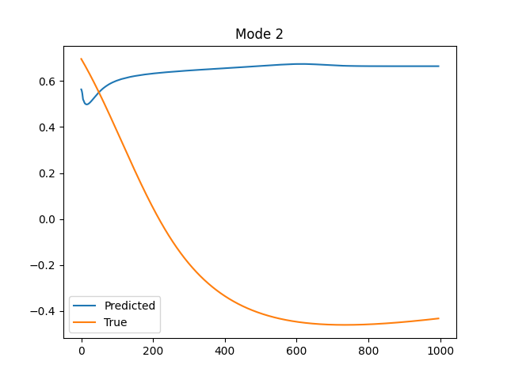

This example was originally written by Romit Maulik and edited by Bethany Lusch.

# Description

The test-case demonstrated here is representative of several Sci-ML workloads. We aim to build a surrogate model using TensorFlow in Python from data generated by a C++ computation. 
The methodology we utilize is something called the "POD-LSTM" - here snapshots of the solution field are linearly compressed using an SVD and the compressed representations are used as training data within a long short-term memory (LSTM) neural network. The LSTM is used to forecast compressed representations of the solution field in the future (for more details please visit our Editor's pick article [here](https://doi.org/10.1063/5.0019884)). However, this educational proxy-app may easily be modified to solve more complex problems (for example: closure modeling, data assimilation, and control) which assess the interplay of compute and ML.

Here is how we connected C++ and Python:

For running this mini-app on ThetaKNL/GPU, look at the scripts/README within `ML_PythonC++_Embedding/ThetaGPU/` and `ML_PythonC++_Embedding/ThetaKNL/` subdirectories.

To see a similar coupling but with OpenFOAM on the C++ side (CFD software), check out our PythonFOAM work ([paper](https://arxiv.org/pdf/2103.09389.pdf), [code](https://github.com/argonne-lcf/PythonFOAM)). 

## What you should see when you run this on either ThetaGPU or ThetaKNL

### Field evolution

### Modal decomposition

### Forecasting the modal evolution in time (still rather poor but you get the idea)

In order to get good results in [our paper](https://doi.org/10.1063/5.0019884), we use more training data. The code for that paper is [here](https://github.com/rmjcs2020/NATSurrogates). 

