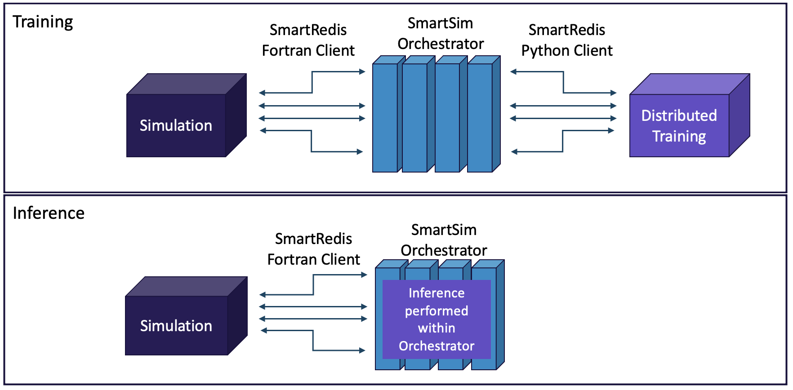
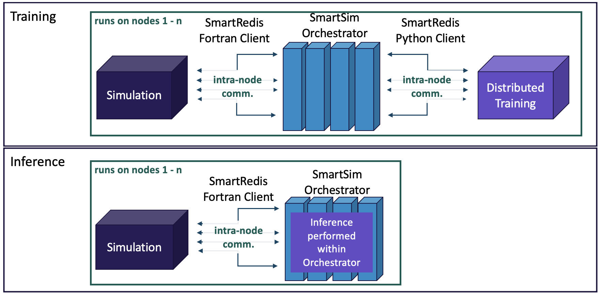

# Combining Simulation and AI/ML with SmartSim
Examples created by Riccardo Balin and edited by Filippo Simini at ALCF.


## Introduction

SmartSim is an open source tool developed by the Hewlett Packard Enterprise (HPE) designed to facilitate the integration of traditional HPC simulation applications with machine learning workflows.
There are two core components to SmartSim:
- Infrastructure library (IL)
  - Provides API to start, stop and monitor HPC applications from Python
  - Interfaces with the scheduler launch jobs (PBSPro on Polaris and Cobalt on Theta/ThetaGPU)
  - Deploys a distributed in-memory database called the Orchestrator
- SmartRedis client library
  - Provides clients that connect to the Orchestrator from Fortran, C, C++, Python code
  - The client API library enables data transfer to/from database and ability to load and run JIT-traced Python and ML runtimes acting on stored data

For more resources on SmartSim, follow the links below:
- [Source code](https://github.com/CrayLabs/SmartSim)
- [Documentation](https://www.craylabs.org/docs/overview.html)
- [Zoo of examples](https://github.com/CrayLabs/SmartSim-Zoo)


## Deploying Workflows with SmartSim

There are two main types of workflows for combining simulation and ML in situ with SmartSim: online training and online inference.
- Online training
  - During online training, the simulation producing the training data and the ML training program using the data run simultaneously
  - There are three components: the data producer (e.g., a numerical simulation), the SmartSim Orchestrator, and the data consumer (e.g., a distributed training program)
  - Data flows from the simulation to the distributed training through the database
  - Training data is stored in-memory within the Orchestrator for the duration of the job, avoiding any I/O bottleneck and disk storage issues
  - Simulation and training are fully decoupled -- do not block each other and run on separate resources (CPU and/or GPU)
- Online inference
  - During online inference, the simulation uses an ML model to replace expensive or inacurate components
  - There are two components: the simulation and the SmartSim Orchestrator
  - Simulation sends model inputs for inference to database, evaluates any model and any pre- and post-processing computations within database, retreives the predictions, and keeps going with rest of computations
  - Compatible TensorFlow, TensorFlow Lite, Torch, and ONNXRuntime backends for model evaluations
  - Supports both both CPU and GPU backends enabling model evaluation on GPU
  - Simulation and model evaluation are loosely coupled -- run on separate resources but inference blocks simulation progress

|  |
| ---- |
| Figure 1. Online training and inference workflows with SmartSim. |

Additionally, there are two approaches to deploying the SmartSim workflow, both for training and inference: clustered and co-located.
- Clustered
  - SmartSim Orchestrator, simulation and ML component run on distinct set of nodes of the same machine
  - Deploy a single database sharded across a cluster of nodes
  - Pros: 
    - All training/inference data is contained in a single database and is visibible by any rank of simulation or ML applications
    - Offers the most flexibility to create complex workflows with additional components (e.g., add in situ visualization, train multiple models by connecting multiple ML applications to Orchestrator, run multiple simulations all contributing to training data set, and more ...)
  - Cons:
    - Reduced data transfer performance to/from Orchestrator as simulation and ML applications scale out
- Co-Located
  - SmartSim Orchestrator, simulation and ML component share resources on each node
  - Distinct database is deployed on each node
  - Pros:
     - Most efficient implementation to scale out (data transfer to/from database effectively constant with number of nodes!)
  - Cons:
    - Training/inference data is distributed across the various databases, accessing off-node data is non-trivial
    - This limits complexity of workflow and number of components deployed

|  |
| ---- |
| Figure 2. Online training and inference with the clustered approach. |

|  |
| ---- |
| Figure 3. Online training and inference with the co-located approach. |

|  |
| ---- |
| Figure 4. Comparison of average data transfer cost from simulation ranks to database for the co-located approach, clustered approach with 1 database node, and clustered approach with 4 database nodes as the number of simulation nodes grow.  |


## Installing SmartSim on ALCF Machines 

A Conda environment with the SmartSim and SmartRedis modules installed has been made available for you to use on Polaris. 
The examples below make use of this environment. 
You can activate it by executing
```
module load conda/2022-...
conda activate /path/to/ssim_env
```

Please note that this environment does not contain all the modules available with the base env from the `conda/2022-...` module, however it contains many of the essential packages, such as PyTorch, TensorFlow, Horovod, and MPI4PY.
If you wish to expand upon this Conda env, feel free to clone it or build your own version of it following this [installation script](installation/install_ssimEnv_Polaris.sh) and executing it with the command
```
source install_ssimEnv_Polaris.sh /path/to/conda/env
```
It is recommended you build the Conda env inside a project space rather than your home space on ALCF systems because it will produce a lot of files and consume disk space.

If you wish to use SmartSim on other ALCF systems (Theta and ThetaGPU), you can find instructions [here](https://github.com/rickybalin/ALCF/tree/main/SmartSim).


## Online Training of Turbulence Closure Model

Train a model online, save it to file.
Can I have a Fortran (or Python if having issues with Redis client library) that loads DNS FHIT data (this would be like loading in a checkpoint) and then goes through a loop (representing the time step loop of a simulation) sending the same data to the DB for training (same because hard to update it, but easy to imagine how this would update in a real simulation).
This should be achievable and should train a usable model for the isotropic SGS model. 
First step should be to load the input/output data for the model instead of having flow data and computing the inputs/outputs within the time step loop. Second step is to add that pre-processing, but this is not an important component of the example and would only make sense to people who know the topic.


## Online Inference of Turbulence Closure Model

Take model trained above and use it for inference.
Can I take the above SGS model, have the same simulation reproducer as above, but now I load in LES input data, go through the time step loop and do basically a priori inference on this data a few times.
Then, I can save the predictions


We assume that you have cloned the repo to a suitable location. These are the steps to execute this example on ThetaKNL from a script. We delay instructions on how to build the conda environment further in this file. In fact, the examples are set up to run with a pre-built environment that all attendees should have acces to.
The pre-build environment is specified at the top of the `run.sh` file [here](example/run.sh).

1. Build the Fortran data loader and the SmartRedis Fortran client API.
- Move to the `example/src/` directory.
- Set the environment in the ThetaKNL terminal with `source env_Theta.sh`.
- Build the code with `./doConfig.sh`.
- NOTE: When using your own conda environment rather then the pre-built one, the path to the SmartRedis client source files much be updated in the `CMakeLists.txt` file (lines 13, 18, 22, 23, 24).  

2. Submit the job.
- Within the `example` directory, submit the job executing the script 
```
./submit.sh
```
This will launch the job in script mode.
- If you wish to submit an interactive job, simply execute the following command from the terminal.
```
qsub -I -q training-knl -n 4 -t 30 -A SDL_Workshop
```
Then, once the interactive session starts, in order to run with the same parameters set by the submit script, execute the following from the MOM node
```
./run.sh 64 4 256 1 2 1 128 64
```

3. Monitor the job output and view the results of the prediction.
- When submitting in scropt mode, monitor the output of the `run.sh` and `driver.py` scripts with
```
tail -f JOBID.output
```
where JOBID is the job ID number assigned during submission. Then monitor the progress of the data loader with
```
tail -f load_data.out
```
and the progress of the training with
```
tail -f train_model.out
```
- Once the job has completed, those files can be viewed with any text editor and a comparison of the model predictions to the true target is available in a figure saved to `fig.pdf`.
- When running in interactive mode, the same files are available to view as the job is running.

## Modify the job's parameters
The `submit.sh` script [here](example/submit.sh) defines the parameters of the job, such as the number of nodes and ranks used by the database, by the simulation and by the ML program. You can feel free to change those parameters and explore performance changes, however keep in mind the following details.
- When using more than 1 node for the database changing the value of `dbnodes`, a few lines of the source code need to change in order to initialize the clients to connect to a database cluster. Line 27 of the [data loader](example/src/load_data.f) must be changed to reflect the new size of the database. Similarly, line 35 of the [training](example/src/trainPar.py).
- A database cluster must request at least 3 nodes, meaning that one can't select to run the database on 2 nodes.
- `simprocs` is the number of processes the data loader runs with. In the example, a value of 128 was set because we set one process per core and used all 128 cores available on 2 nodes. In general, one does not have to use all cores on a node.
- `mlprocs` is the number of processes the data consumer runs with. In the example, a value of 64 was used to use all 64 cores on the node assigned to the ML program. This value can be increased or decreased along with the value of `mlnodes` to scale the training up or down.


# Building the Conda Environment

The commands required to build the conda environment are included in two scripts. The [first script](install_ssim_theta.sh) creates the new conda environment and installs SmartSim and SmartRedis. The [second script](install_horovod_theta.sh) installs Horovod in the environment.

To run the first script, execute
```
source install_ssim_theta.sh /path/to/env/
```
Note that the script takes as argument the path to the location where you wish this environment to be created. The name of the environment is `ssim` by default, but it can be changed within the script.
Also, please note that in some occasions, the last command in the script fails to execute successfully. If that is the case, you will notice an error message in the output and you simply execute the `make lib` command again to complete the build of SmartRedis.

To run the second script, make sure you are not within one of the `smartsim` or `smartredis` directories, and then execute
```
./install_horovod_theta.sh
```

Finally, to activate the environment, make sure to either execute these commands or include them in your scripts before running jobs with SmartSim.
```
module swap PrgEnv-intel PrgEnv-gnu
export CRAYPE_LINK_TYPE=dynamic
module load miniconda-3/2021-07-28
conda activate /path/to/env/ssim
```
