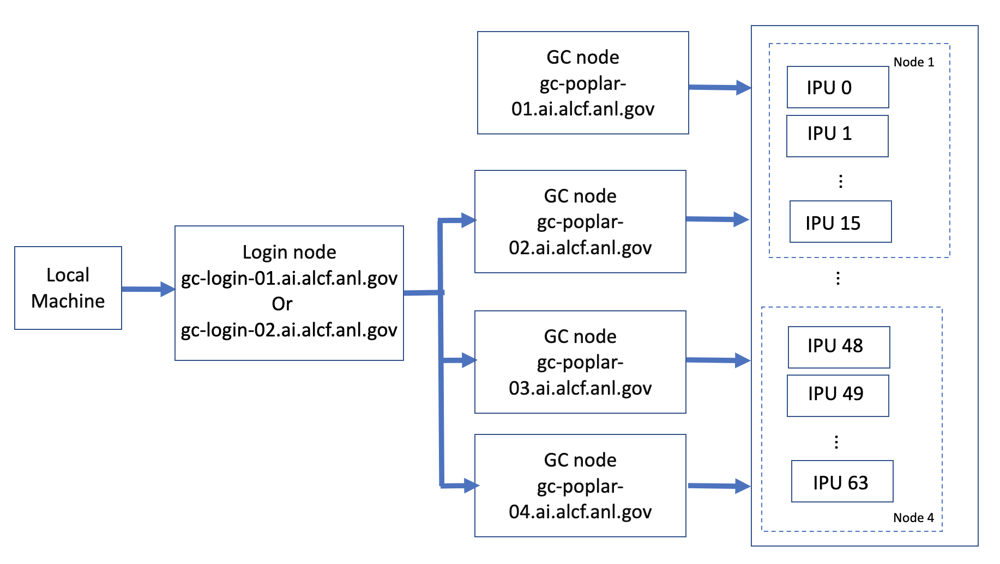

# Graphcore 

## Connection to Graphcore 



Login to the Graphcore login node from your local machine.
Once you are on the login node, ssh to one of the Graphcore nodes.

```bash
ssh ALCFUserID@gc-login-01.ai.alcf.anl.gov
# or
ssh ALCFUserID@gc-login-02.ai.alcf.anl.gov

ssh gc-poplar-02.ai.alcf.anl.gov
# or
ssh gc-poplar-03.ai.alcf.anl.gov
# or
ssh gc-poplar-04.ai.alcf.anl.gov
```

## Create Virtual Environment 


### PyTorch virtual environment

```bash
mkdir -p ~/venvs/graphcore
virtualenv ~/venvs/graphcore/poptorch33_env
source ~/venvs/graphcore/poptorch33_env/bin/activate

POPLAR_SDK_ROOT=/software/graphcore/poplar_sdk/3.3.0
export POPLAR_SDK_ROOT=$POPLAR_SDK_ROOT
pip install $POPLAR_SDK_ROOT/poptorch-3.3.0+113432_960e9c294b_ubuntu_20_04-cp38-cp38-linux_x86_64.whl
```

### Tensorflow virtual environment

```bash
virtualenv ~/venvs/graphcore/tensorflow2_33_env
source ~/venvs/graphcore/tensorflow2_33_env/bin/activate

POPLAR_SDK_ROOT=/software/graphcore/poplar_sdk/3.3.0
export POPLAR_SDK_ROOT=$POPLAR_SDK_ROOT
pip install $POPLAR_SDK_ROOT/tensorflow-2.6.3+gc3.3.0+251580+08d96978c7f+amd_znver1-cp38-cp38-linux_x86_64.whl
pip install $POPLAR_SDK_ROOT/keras-2.6.0+gc3.3.0+251582+a3785372-py2.py3-none-any.whl
```

## Clone Graphcore Examples

We use examples from [Graphcore Examples repository](https://github.com/graphcore/examples) for this hands-on. 
Clone the Graphcore Examples repository.
```bash
mkdir ~/graphcore
cd ~/graphcore
git clone https://github.com/graphcore/examples.git
cd examples
```

## Job Queuing and Submission

ALCF's Graphcore POD64 system uses Slurm for job submission and queueing. Below are some of the important commands for using Slurm.

* The Slurm command `srun` can be used to run individual Python scripts. Use the --ipus= option to specify the number of IPUs required for the run.
`srun --ipus=1 python mnist_poptorch.py`
* The jobs can be submitted to the Slurm workload manager through a batch script by using the `sbatch` command
* The `squeue` command provides information about jobs located in the Slurm scheduling queue.
* `SCancel` is used to signal or cancel jobs, job arrays, or job steps.

## Run Examples

Refer to respective instrcutions below 
* [MNIST](./mnist.md)
!<--- * [Resnet50 using replication factor](./resnet50.md) --->
* [GPT2](./gpt2.md)
